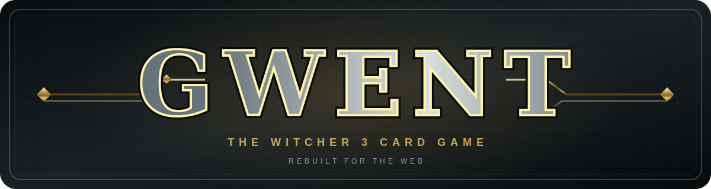

<div align="center">
  

  <p><strong>A faithful, full-featured browser recreation of The Witcher 3 Gwent mini-game.</strong></p>

  <p>
    <a href="https://easygwent.online"><strong>Play at easygwent.online</strong></a>
    ·
    <a href="#features">Features</a>
    ·
    <a href="#run-it-locally">Run locally</a>
    ·
    <a href="#deploy-your-own-instance">Self-host</a>
  </p>
</div>

> [!NOTE]
> Easy Gwent is an unofficial, noncommercial fan work and is not approved or
> endorsed by CD PROJEKT RED.

---

## Features

| | |
|---|---|
| **Faithful rules** | Factions, leaders, weather, heroes, spies, medics, Muster, Tight Bond, Morale Boost, Scorch, Decoy, and other Witcher 3 mini-game mechanics. |
| **Play your way** | Battle locally against easy, medium, or hard AI, or create a private online room and challenge another player. |
| **Build a deck** | Artwork-first deck editor with validation, search, card-type filters, leader selection, and saved faction decks. |
| **Online multiplayer** | Accounts, invite codes, reconnect and resume, rematches, persistent match statistics, and a leaderboard. |
| **A living battlefield** | Row-specific frost, fog, and rain visuals, clear turn and pass states, animated card reveals, and synthesized sound effects. |
| **Desktop and mobile** | Responsive layouts designed for mouse, touch, portrait phones, and compact landscape screens. |

---

## The project

Easy Gwent focuses on the card game found inside **The Witcher 3: Wild Hunt**,
not the later standalone GWENT game. The rules engine is kept separate from the
React interface so gameplay remains deterministic, testable, and reusable by
the AI and multiplayer server.

```text
packages/
├── data      Card definitions, shared types, and faction lists
├── engine    Pure rules, scoring, setup, and multiplayer protocol
├── ai        Easy, medium, and hard opponent heuristics
├── client    React and Vite browser interface
└── server    HTTP, WebSocket, authentication, rooms, stats, and SQLite
```

The repository is a strict TypeScript npm workspace. Tests live beside their
packages under `packages/*/test/` and run with Vitest.

---

## Run it locally

```bash
git clone https://github.com/kbmod/easy-gwent.git
cd easy-gwent
npm install
npm run build
npm start
```

Open `http://localhost:8787`. The production-style server hosts the built
client, API, WebSocket endpoint, card assets, and local SQLite database from a
single process.

For live development, use two terminals:

```bash
npm run dev:server   # API and multiplayer server on :8787
npm run dev          # Vite client on :5173
```

Useful checks and asset commands:

```bash
npm test                  # complete Vitest suite
npm run build:code        # build without downloading card images
npm run fetch-assets      # fetch missing card images only
npm run build-card-text   # refresh committed card text
npm run refresh-wiki-cache # refresh gitignored rules references
```

---

## Card text and artwork

| Material | In Git? | How it is handled |
|---|---:|---|
| Ability and flavor text | Yes | Stored in `packages/data/src/card-text.json`; missing entries fall back to generated rules text. |
| Card artwork | No | Downloaded at build time from URLs in `scripts/asset-manifest.json` into the gitignored `assets/cards/` directory. |
| Raw wiki reference | No | Cached under the gitignored `.wiki-cache/witcher3-gwent/` directory for mechanics verification. |

If artwork is unavailable, the client uses generated SVG placeholders, so the
game and code-only build remain functional.

---

## License and rights

Original project code and project-authored material are available under the
[PolyForm Noncommercial License 1.0.0](LICENSE.md). Personal use, modification,
forking, and noncommercial redistribution are permitted. Commercial use
requires prior explicit written permission from the copyright holder and may
also require permission from applicable third-party rights holders. See the
complete [licensing overview](LICENSING.md).

The Witcher, Gwent, related names, characters, text, artwork, and images belong
to or are licensed by CD PROJEKT S.A. and their respective rights holders. The
project license does not grant rights to that material. See
[Third-Party Notices](NOTICE.md) and the
[CD PROJEKT RED Fan Content Guidelines](https://www.cdprojektred.com/en/fan-content).

---

## Support the project

<div align="center">
  <p>If you like Easy Gwent and want to support its continued development,<br><strong>buy me a coffee.</strong></p>
  <a href="https://www.pasteboard.co/YaTW87eP8k1h.png">
    
  </a>
  <p><sub>Scan the QR code or click it to open the full-size image.</sub></p>
</div>

---

## Deploy your own instance

You need Node.js 20 LTS or a newer LTS release, npm, persistent storage for
SQLite, and—if the instance is public—a reverse proxy with HTTPS and WebSocket
support.

### 1. Install, verify, and build

```bash
git clone https://github.com/kbmod/easy-gwent.git
cd easy-gwent
npm install
npm test
npx tsc --noEmit
npm run build
```

`npm run build` downloads the uncommitted card artwork and creates the client
bundle. Use `npm run build:code` if you intentionally want placeholders only.

### 2. Start the application

```bash
HOST=127.0.0.1 PORT=8787 npm start
```

The defaults can be overridden when needed:

| Variable | Default | Purpose |
|---|---|---|
| `HOST` | `0.0.0.0` | Server bind address |
| `PORT` | `8787` | HTTP and WebSocket port |
| `GWENT_DB` | `packages/server/data/gwent.sqlite` | Persistent SQLite database path |
| `STATIC_DIR` | `packages/client/dist` | Built client directory |
| `ASSETS_DIR` | `assets` | Root containing downloaded card art |
| `GWENT_GRACE_MS` | `60000` | Reconnect window before an online forfeit |
| `GWENT_ROOM_WAIT_MS` | `1800000` | Unstarted room lifetime |
| `GWENT_POSTGAME_MS` | `600000` | Completed room/rematch lifetime |

Keep the SQLite database and its `-wal`/`-shm` sidecars on persistent storage.
The included `packages/server/scripts/backup-db.mjs` script creates a safe
SQLite backup.

### 3. Put it behind HTTPS

A minimal Caddy configuration automatically handles TLS and WebSocket upgrades:

```caddyfile
gwent.example.com {
    reverse_proxy 127.0.0.1:8787
}
```

Run `npm start` under a process supervisor such as systemd, using an unprivileged
service account and the repository as its working directory. Rebuild after
pulling updates; restart the process when server code or dependencies change.
Client-only rebuilds are served immediately from the new static bundle.
